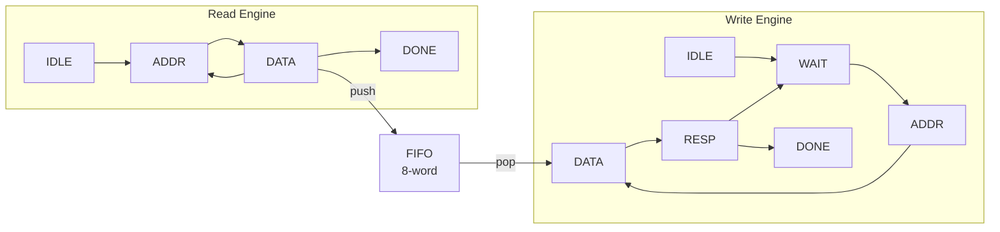
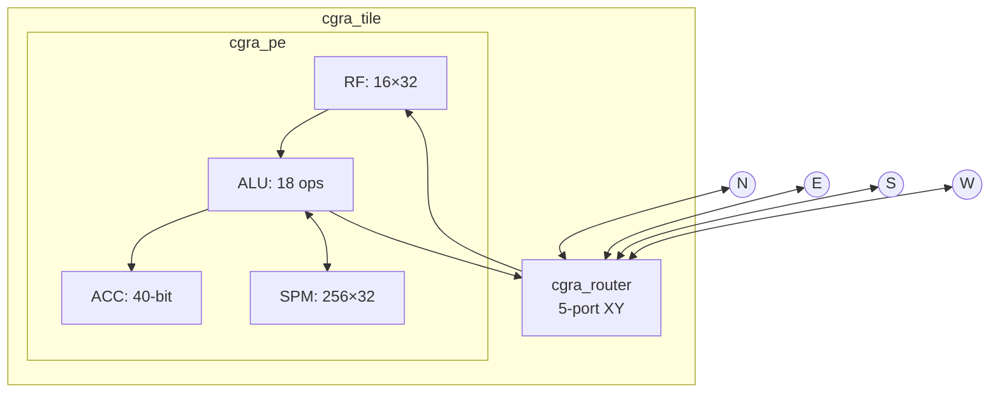

# CGRA SoC Block Diagram

> Render at: https://mermaid.live/

## Top-Level Architecture (Current Implementation)

```mermaid
flowchart TB
    %% ===========================================================================
    %% Styling
    %% ===========================================================================
    classDef external fill:#e1f5fe,stroke:#0288d1,stroke-width:2px
    classDef control fill:#fff3e0,stroke:#ff9800,stroke-width:2px
    classDef datapath fill:#e8f5e9,stroke:#4caf50,stroke-width:2px
    classDef memory fill:#fce4ec,stroke:#e91e63,stroke-width:2px
    classDef compute fill:#ede7f6,stroke:#673ab7,stroke-width:2px
    classDef fifo fill:#e3f2fd,stroke:#2196f3,stroke-width:2px

    %% ===========================================================================
    %% External Interfaces
    %% ===========================================================================
    HOST[/"Host CPU<br/>(ARM Cortex-A9)"/]:::external
    DDR[("axi_ram<br/>128KB")]:::external

    %% ===========================================================================
    %% CGRA Top Module
    %% ===========================================================================
    subgraph TOP["cgra_top"]
        direction TB
        
        %% -----------------------------------------------------------------------
        %% Control Path
        %% -----------------------------------------------------------------------
        subgraph CTRL_PATH["Control Path (APB)"]
            direction LR
            
            CSR["cgra_axi_csr<br/>───────────<br/>DMA_CTRL [0x00]<br/>DMA_STATUS [0x04]<br/>DMA_SRC [0x08]<br/>DMA_DST [0x0C]<br/>DMA_SIZE [0x10]<br/>CU_CTRL [0x20]<br/>CU_STATUS [0x24]"]:::control
            
            CU["cgra_control_unit<br/>─────────────<br/>FSM: IDLE → RUN<br/>→ DONE<br/>─────────────<br/>cycle_counter<br/>pe_reset_n"]:::control
        end
        
        %% -----------------------------------------------------------------------
        %% Pipelined DMA Engine
        %% -----------------------------------------------------------------------
        subgraph DMA_ENGINE["cgra_dma_engine (Pipelined)"]
            direction LR
            
            READ_ENG["Read Engine<br/>(Producer)<br/>──────────<br/>R_IDLE<br/>R_ADDR<br/>R_DATA<br/>R_DONE"]:::datapath
            
            FIFO["FIFO<br/>────<br/>8×32b<br/>count"]:::fifo
            
            WRITE_ENG["Write Engine<br/>(Consumer)<br/>──────────<br/>W_IDLE→WAIT<br/>→ADDR→DATA<br/>→RESP→DONE"]:::datapath
            
            READ_ENG --> FIFO --> WRITE_ENG
        end
        
        %% -----------------------------------------------------------------------
        %% Compute Fabric (4x4 PE Array)
        %% -----------------------------------------------------------------------
        subgraph FABRIC["cgra_array_4x4"]
            direction TB
            
            subgraph R0["Row 0"]
                direction LR
                PE00["cgra_tile<br/>───────<br/>PE + Router<br/>SPM: 256×32"]:::compute
                PE01["tile<br/>0,1"]:::compute
                PE02["tile<br/>0,2"]:::compute
                PE03["tile<br/>0,3"]:::compute
            end
            
            subgraph R1["Row 1"]
                direction LR
                PE10["tile<br/>1,0"]:::compute
                PE11["tile<br/>1,1"]:::compute
                PE12["tile<br/>1,2"]:::compute
                PE13["tile<br/>1,3"]:::compute
            end
            
            subgraph R2["Row 2"]
                direction LR
                PE20["tile<br/>2,0"]:::compute
                PE21["tile<br/>2,1"]:::compute
                PE22["tile<br/>2,2"]:::compute
                PE23["tile<br/>2,3"]:::compute
            end
            
            subgraph R3["Row 3"]
                direction LR
                PE30["tile<br/>3,0"]:::compute
                PE31["tile<br/>3,1"]:::compute
                PE32["tile<br/>3,2"]:::compute
                PE33["tile<br/>3,3"]:::compute
            end
        end
    end

    %% ===========================================================================
    %% External Connections
    %% ===========================================================================
    HOST ===|"APB Slave"| CSR
    
    READ_ENG ===|"AXI AR/R"| DDR
    WRITE_ENG ===|"AXI AW/W/B"| DDR

    %% ===========================================================================
    %% Internal Connections
    %% ===========================================================================
    CSR -->|"start, reset"| CU
    CSR -->|"cfg_src/dst/size"| DMA_ENGINE
    CU -->|"busy, done"| CSR
    WRITE_ENG -->|"status"| CSR
    CU -->|"pe_enable,<br/>pe_reset_n"| FABRIC

    %% ===========================================================================
    %% Mesh Interconnect
    %% ===========================================================================
    PE00 <--> PE01 <--> PE02 <--> PE03
    PE10 <--> PE11 <--> PE12 <--> PE13
    PE20 <--> PE21 <--> PE22 <--> PE23
    PE30 <--> PE31 <--> PE32 <--> PE33
    PE00 <--> PE10 <--> PE20 <--> PE30
    PE01 <--> PE11 <--> PE21 <--> PE31
    PE02 <--> PE12 <--> PE22 <--> PE32
    PE03 <--> PE13 <--> PE23 <--> PE33
```

---

## DMA Engine Detail

---

## Each cgra_tile Contains

---

## Note on cgra_tile_memory

The file `cgra_tile_memory.sv` exists but is **NOT currently instantiated** in `cgra_top.sv`. 

Each PE has its own **internal scratchpad** (256×32-bit) inside `cgra_pe.sv`. The tile_memory module was designed for a shared row memory architecture but hasn't been integrated yet.

---

## Key Metrics

| Component | Spec |
|-----------|------|
| PE Array | 4×4 = 16 tiles |
| SPM per PE | 256 × 32-bit |
| DMA FIFO | 8 × 32-bit |
| Throughput | 0.64 B/cycle |
| Test Vectors | 90+ |
