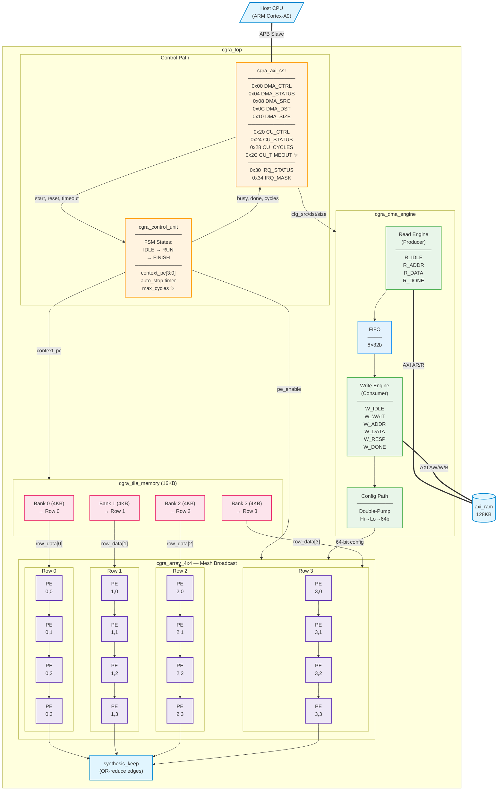
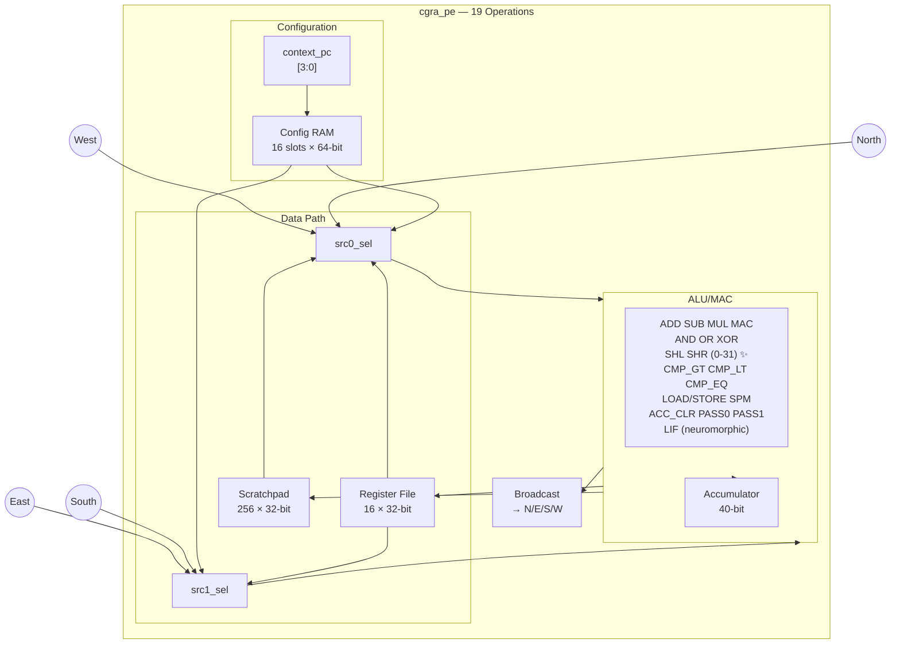
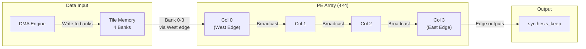

# CGRA SoC Block Diagram

> Updated: December 2024 | 141/141 Tests Passed | Silicon Ready

---

## Top-Level Architecture

---

## Processing Element (cgra_pe)

---

## Data Flow (West → East Streaming)

---

## Key Metrics

| Component | Specification | Verified |
|-----------|---------------|----------|
| PE Array | 4×4 = 16 tiles | ✅ Suite O |
| SPM per PE | 256 × 32-bit | ✅ Suite T |
| Register File | 16 × 32-bit | ✅ |
| DMA FIFO | 8 × 32-bit | ✅ Suite B |
| Tile Memory | 4 banks × 4KB = 16KB | ✅ Suite J |
| Test Suites | **23** (A-V, Q1-Q2) | ✅ |
| Test Vectors | **141** | ✅ |
| ISA Operations | **19 verified** | ✅ Suite T,U,V |
| Barrel Shifter | 5-bit (0-31) | ✅ Suite Q2 ✨ |
| Mesh Broadcast | PE → 4 neighbors | ✅ Suite L |
| Auto-Stop | Programmable timeout | ✅ CSR 0x2C |
| Neuromorphic | LIF neuron | ✅ Suite V |

---

## APB Register Map

| Offset | Name | Access | Description |
|--------|------|--------|-------------|
| 0x00 | DMA_CTRL | RW | [0] Start (auto-clear) |
| 0x04 | DMA_STATUS | RO | [0] Busy, [1] Done |
| 0x08 | DMA_SRC | RW | Source address |
| 0x0C | DMA_DST | RW | Destination address |
| 0x10 | DMA_SIZE | RW | Transfer size (bytes) |
| 0x20 | CU_CTRL | RW | [0] Start, [1] Soft Reset |
| 0x24 | CU_STATUS | RO | [0] Busy, [1] Done |
| 0x28 | CU_CYCLES | RO | Cycle counter |
| **0x2C** | **CU_TIMEOUT** | **RW** | **Max cycles (0 = no limit)** ✨ |
| 0x30 | IRQ_STATUS | RO | [0] DMA Done, [1] CU Done |
| 0x34 | IRQ_MASK | RW | IRQ enable mask |

---

## ISA Summary (19 Operations)

| Op | Name | Operation | Test |
|----|------|-----------|------|
| 0 | NOP | No operation | M |
| 1 | ADD | A + B (saturating) | M, Q |
| 2 | SUB | A - B (saturating) | M, N |
| 3 | MUL | A × B | M |
| 4 | MAC | Acc += A × B | T |
| 5 | AND | A & B | K, M |
| 6 | OR | A \| B | K, M |
| 7 | XOR | A ^ B | K, M |
| 8 | SHL | A << B[4:0] | Q2 ✨ |
| 9 | SHR | A >>> B[4:0] (arith) | Q2 ✨ |
| 10 | CMP_GT | (A > B) ? 1 : 0 | T |
| 11 | CMP_LT | (A < B) ? 1 : 0 | T, U |
| 12 | CMP_EQ | (A == B) ? 1 : 0 | P |
| 13 | LOAD_SPM | Load from scratchpad | T |
| 14 | STORE_SPM | Store to scratchpad | T |
| 15 | ACC_CLR | Clear accumulator | T, V |
| 16 | PASS0 | Pass operand 0 | T |
| 17 | PASS1 | Pass operand 1 | T |
| 18 | LIF | Leaky Integrate-Fire | V |

---

## Architecture Fixes Applied

| Fix | Issue | Solution |
|-----|-------|----------|
| #1 | PE N/E/S/W inputs identical | Direct tile port wiring |
| #2 | Config 32→64 bit data loss | Double-pump protocol |
| #3 | Bank address hardcoded | context_pc streaming |
| #4 | PE outputs disconnected | Mesh broadcast |
| #5 | PE_SEL encoding overlap | Bits [11:8] decode |
| #6 | Auto-stop fixed at 16 | **Programmable timeout** ✨ |
| #7 | Shift mask [3:0] | **5-bit [4:0] + arithmetic SHR** ✨ |
