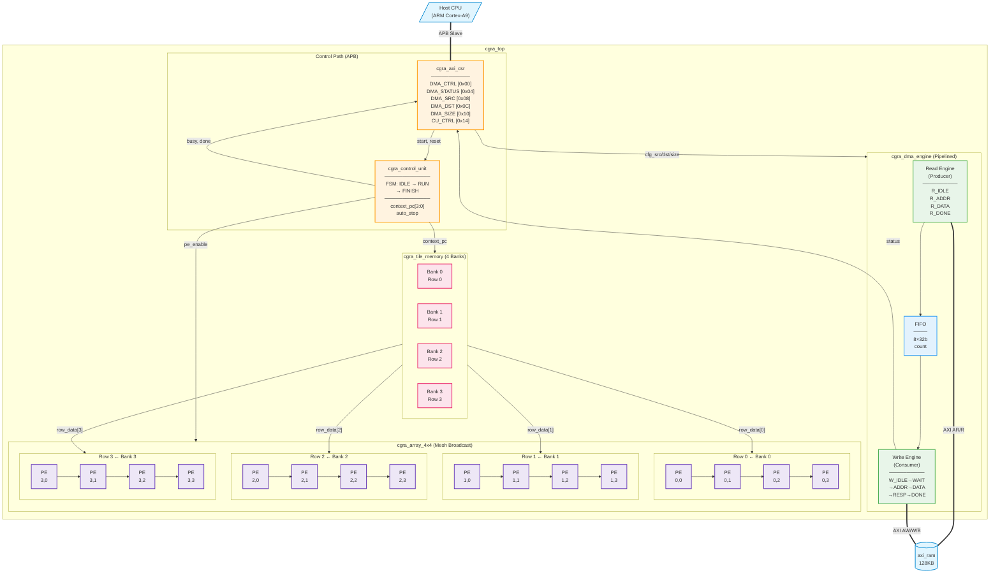
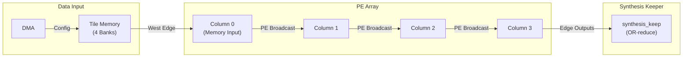
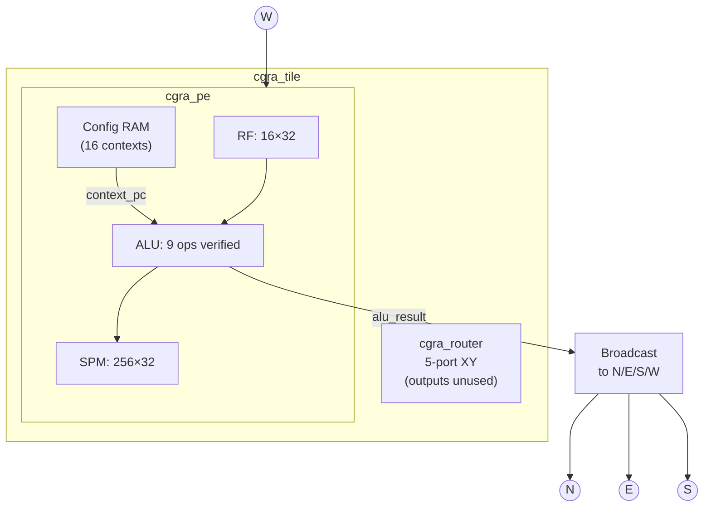

# CGRA SoC Block Diagram

> Render at: https://mermaid.live/

## Top-Level Architecture (Current Implementation)

---

## Data Flow Architecture

---

## Each cgra_tile Contains

---

## Key Metrics (Verified)

| Component | Spec | Verified |
|-----------|------|----------|
| PE Array | 4×4 = 16 tiles | ✅ Suite O |
| SPM per PE | 256 × 32-bit | ✅ |
| DMA FIFO | 8 × 32-bit | ✅ Suite B |
| Tile Memory | 4 banks × 4KB | ✅ Suite J |
| Test Suites | 19 (A-S) | ✅ |
| Test Vectors | **126** | ✅ |
| ISA Operations | 9 verified | ✅ Suite M |
| Mesh Broadcast | PE → Neighbors | ✅ Suite L |
| Auto-Stop | 16-cycle trigger | ✅ |

---

## Architecture Fixes Applied

| Fix | Issue | Solution |
|-----|-------|----------|
| #1 | PE N/E/S/W inputs same | Direct tile port wiring |
| #2 | Config 32→64 bit loss | Double-pump loader |
| #3 | Bank addr hardcoded | context_pc streaming |
| #4 | PE outputs disconnected | Mesh broadcast |
| #5 | pe_sel encoding overlap | Bits [11:8] not [7:4] |
