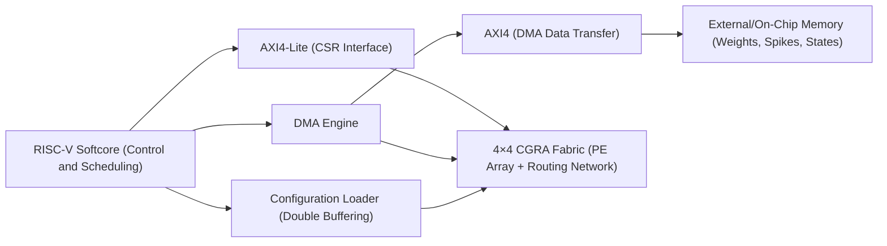
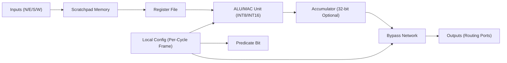
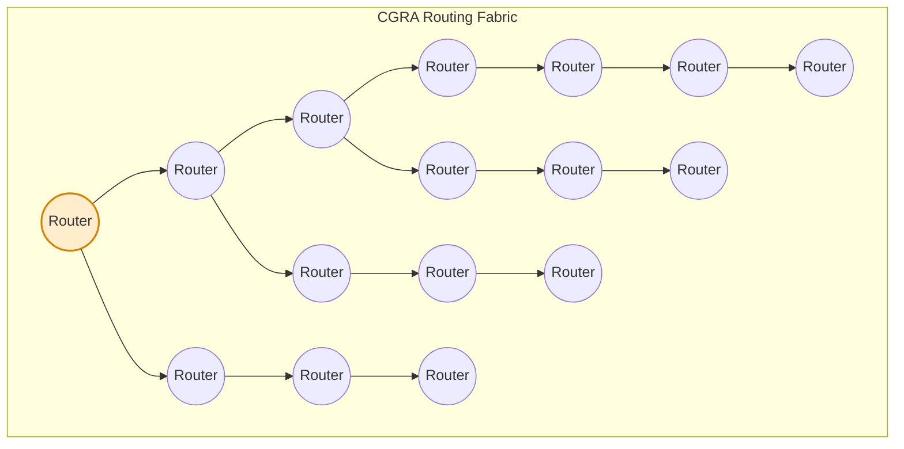
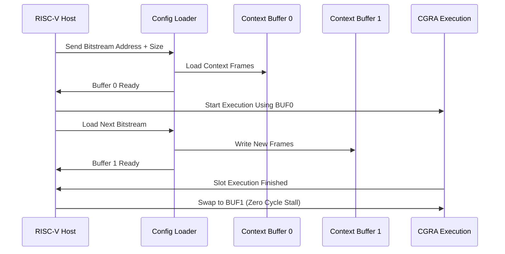
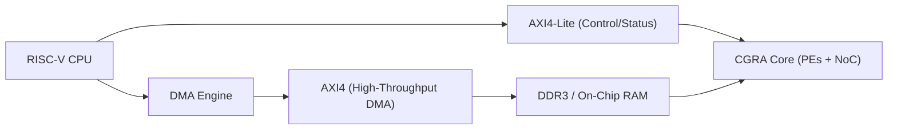
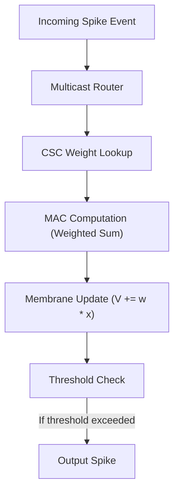

# CGRA Accelerator Specification for SNN Inference  
*Complete HAS–MAS–LAS Architecture Specification with Diagrams (Markdown Version)*  

---

# 1. High-Abstraction Specification (HAS)

## 1.1 Project Goal  
Design a **Coarse-Grained Reconfigurable Architecture (CGRA)** accelerator for **Spiking Neural Network (SNN)** inference on the **DE10-Standard FPGA**, tightly integrated with a **RISC-V softcore** via AXI4-Lite (control) and AXI4 (DMA).  
The architecture must:  
- Exploit spike sparsity  
- Accelerate CSC-based synaptic updates  
- Provide multicast/broadcast routing  
- Support double-buffered reconfiguration  
- Deliver higher efficiency than CPU-only execution  

---

## 1.2 System Architecture  
The system includes:  
- RISC-V softcore (firmware control + scheduling)  
- AXI4-Lite CSR block  
- AXI4 DMA engine  
- CGRA fabric (4×4 PEs + routing network)  
- Configuration loader  
- External/On-chip memory  

### **Figure 1 — System Architecture Diagram**


---

## 1.3 Key Requirements  
### Functional  
- SNN inference for networks mapped into CSC format  
- Event-driven execution model  
- Multicast-aware routing  
- AXI4-Lite control; AXI4 DMA for data movement  
- Safe reconfiguration with atomic context swap  

### Performance KPIs  
- **Latency**: ≥2×–5× improvement over CPU baseline  
- **PE Utilization**: ≥70% on mapped workloads  
- **Memory Traffic Reduction**: ≥30% due to sparsity  
- **Clock Frequency**: Target 50–100 MHz  

---

# 2. Medium-Abstraction Specification (MAS)

## 2.1 CGRA Overview  
A **4×4 Processing Element array** connected by a deterministic XY mesh network.  
Each PE contains:  
- ALU/MAC  
- Scratchpad  
- Bypass fabric  
- Routing ports  
- Predicate execution  
- Per-cycle configuration word  

### **Figure 2 — 4×4 CGRA PE Array**
```mermaid
graph TD

subgraph CGRA_Array["4×4 CGRA Processing Element Array"]
PE00[PE(0,0)] --> PE01
PE01 --> PE02
PE02 --> PE03

PE10[PE(1,0)] --> PE11
PE11 --> PE12
PE12 --> PE13

PE20[PE(2,0)] --> PE21
PE21 --> PE22
PE22 --> PE23

PE30[PE(3,0)] --> PE31
PE31 --> PE32
PE32 --> PE33

PE00 --> PE10 --> PE20 --> PE30
PE01 --> PE11 --> PE21 --> PE31
PE02 --> PE12 --> PE22 --> PE32
PE03 --> PE13 --> PE23 --> PE33
end
```

---

## 2.2 Processing Element Microarchitecture  
Each PE executes one operation per cycle based on its configuration frame.

### **Figure 3 — Processing Element Diagram**


---

## 2.3 Routing Network  
Mesh routing with unicast, multicast, broadcast. Used to propagate spikes efficiently.

### **Figure 4 — Multicast Routing Network**


---

## 2.4 Configuration Loader (Double Buffering)  
Ensures zero-stall reconfiguration while CGRA is running.

### **Figure 5 — Configuration Loader Sequence**


---

## 2.5 AXI Interface Architecture  

### **Figure 6 — AXI4-Lite + AXI4 Integration**


---

# 3. SNN Execution Model

## 3.1 CSC Representation  
Weights stored column-wise:  
- `col_ptr[n_pre]`  
- `row_idx[]`  
- `values[]`  

## 3.2 SNN Event Flow  
Each incoming spike triggers lookup, MAC, threshold, next spike generation.

### **Figure 7 — Event-Driven SNN Flow**


---

# 4. Low-Abstraction Specification (LAS)

## 4.1 PE Context Frame Format (64-bit)
| Bits | Name | Description |
|------|------|-------------|
| 5:0 | op_code | ALU/MAC/Load/Store |
| 9:6 | src0 | operand 0 select |
| 13:10 | src1 | operand 1 select |
| 17:14 | dst | destination select |
| 21:18 | route | N/E/S/W/local mask |
| 22 | pred_en | enable predicate |
| 23 | pred_inv | invert predicate |
| 39:24 | imm | 16-bit immediate |
| 63:40 | extended | metadata |

---

## 4.2 CSR Map (AXI4-Lite)

| Offset | Name | Access | Description |
|--------|------|--------|-------------|
| 0x00 | CTRL | R/W | start, reset, cfg_start |
| 0x04 | STATUS | R/W1C | busy, done, error, cfg_done |
| 0x08 | BITSTR_ADDR | R/W | bitstream base addr |
| 0x0C | BITSTR_SIZE | R/W | bitstream size |
| 0x10 | DMA_DOORBELL | W | DMA start |
| 0x14 | DMA_HEAD | R | head pointer |
| 0x18 | JOB_DESC_ADDR | R/W | descriptor address |
| 0x1C | PERF0 | R | cycles |
| 0x20 | PERF1 | R | stalls / memory ops |
| 0x24 | IRQ_MASK | R/W | enable IRQs |

---

## 4.3 FSM Summary

### Configuration FSM  
States:
- IDLE  
- LOAD_HEADER  
- LOAD_FRAMES  
- SWAP  
- DONE  

### Execution FSM  
- IDLE  
- WAIT_CFG  
- SETUP_DMA  
- RUN  
- DRAIN  
- COMPLETE  
- ERROR  

---

# 5. Verification Plan

## Unit Tests  
- PE ALU/MAC  
- Router XY routing + multicast  
- Scratchpad reads/writes  
- CSR access tests  

## Integration Tests  
- AXI4-Lite + AXI4 DMA correctness  
- Job execution (SNN kernels)  
- Context switching safety  

## KPIs to Measure  
- Latency per inference  
- PE utilization  
- Memory traffic reduction  
- Speedup vs CPU baseline  

---

# 6. Conclusion  
This specification defines a complete CGRA accelerator optimized for SNN inference on FPGA, with a full programming, routing, scheduling, and execution model, supported by a structured verification and measurement methodology.

---

**End of File**
